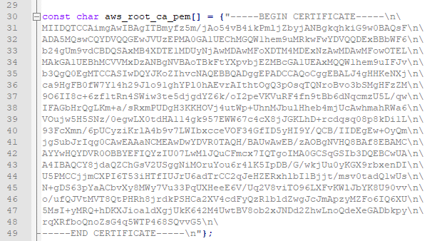

The last step before the Session is to push code and a certificate file to the IoT Device and validating it works.

## Create a certificate file

1.  Use a text editor to open the “aws_iot_certificates.c.old” file - Notepad++ is the preferred and demonstrated method
    1.  By default, it is located at “C:\\Program Files (x86)\\Arduino\\libraries\\AWS_IOT\\”
    2.  You should see 3 different arrays, currently filled with all x’s. They are named
        1.  aws_root_ca_pem
        2.  certificate_pem_crt
        3.  private_pem_key
    3.  Note that the end of every line is a “\\n\\”
2.  Use a text editor to open the AWS root certificate you downloaded named “AmazonRootCA1.pem”
3.  Copy all of the text on lines 2-19, between the “-----BEGIN CERTIFICATE-----” and “-----END CERTIFICATE-----”
4.  In the “aws_iot_certificates.c.old” file replace all of the x’s in the array “aws_root_ca_pem” by pasting the AmazonRootCA1 data in place of it
5.  At the end of every line you replaced, add “\\n\\”. The result would look like this

6.  Use a text editor to open the certificate pem file the ends in “-certificate.pem.crt.txt”
7.  Using the same copy and paste method in steps “c” and “d”, replace the contents of the array “certificate_pem_key” with the contents of the certificate pem file
8.  At the end of every line you replaced, add “\\n\\”
9.  Use a text editor to open the private pem key file the ends in “-private.pem.key”
10.  Using the same copy and paste method in steps “c” and “d”, replace the contents of the array “private_pem_key” with the contents of the private pem key file
11.  At the end of every line you replaced, add “\\n\\”.
12.  Save the “aws_iot_certificates.c.old” file as “aws_iot_certificates.c” in your **project folder**
     1.  You will use this file for you upcoming Arduino project

## Preparing your IoT Device code

1.  Download the example IoT Temperature Sensor code from [TempGatherPlusIoT.ino](../TempGatherPlusIoT.ino) to your project folder
2.  Open Arduino
3.  Click on “File” and then “Open”
4.  Navigate to your project folder
5.  Select the TempGatherPlusIoT.ino file you downloaded
6.  You now need to modify the 5 variables listed in the code
    1.  WIFI_SSID = {Your local wifi SSID}
    2.  WIFI_PASSWORD = {Your local wifi password}
    3.  HOST_ADDRESS = The Rest API Endpoint text you copied in Step 31 previously
    4.  CLIENT_ID = The Thing name text you copied in Step 32 previously
    5.  TOPIC_NAME = The “Update to this thing shadow” you copied in Step 31 previously
7.  Click on “Sketch” in the top navigation
8.  Click on “Add file”
9.  Select the “aws_iot_certificates.c” in your project folder
10. Click on “File” and then “Save”
11. Click on the checkmark under the navigation bar to validate your code is properly compiling

If you are running into issues with compiling your code, check the [FAQ](../Instructions/FAQ.md#setup-and-build) for potential solutions.

## Pushing Code to your IoT Device

1.  Click on “Tools”
2.  Click on “Port”
    1.  Make note of the available COM ports.
    2.  If there are no available COM ports, Port won't be an option
3.  Click back into the editor
4.  Using your USB cable, plug your IoT device into your computer
5.  Click on “Tools”, and then “Ports”
6.  A new port should appear; click on it to set the port.
7.  Click on “Tools” and set the following settings
    1.  Upload Speed: 921600
    2.  Flash Frequency: 80MHz
8.  Click on “Tools”, and then “Serial Monitor”
    1.  If not already configured, set the Serial Monitor baud rate to 115200 baud.
    2.  You should see default code from the IoT device scrolling.
    3.  If not, close and restart Arduino and try each port.
9.  Once the connection is established, click on the Right Arrow under the navigation bar
    1.  This will push the code to the ESP32

If the ESP32 chip fails to load the code, check the [FAQ](../Instructions/FAQ.md#setup-and-build) for potential solutions.

## Validating it works

1.  Back on your AWS IoT console interface make sure you are looking at the Thing you created
2.  Click on “Activity” on the left hand navigation
    1.  You should see a window with updated temperature and humidity data
3.  Additionally, in Arduino click on “Tools”, and then “Serial Monitor”
    1.  Here you should see “Publish Message” and then the data.
    2.  If you see error messages, they should help you troubleshoot the problem.

With that done and validated, we can now move on to the 1 hour lab for using Device Defender to audit and protect your IoT Fleet. Here are the [instructions to start the lab](../Instructions/Instruction.md).
